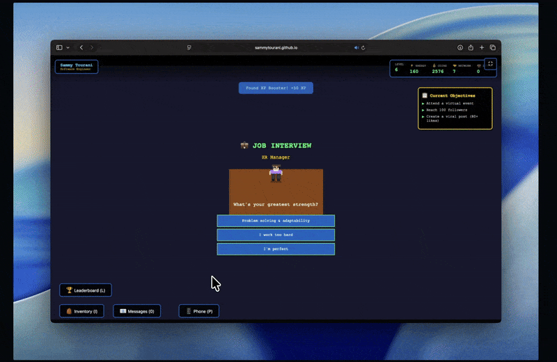
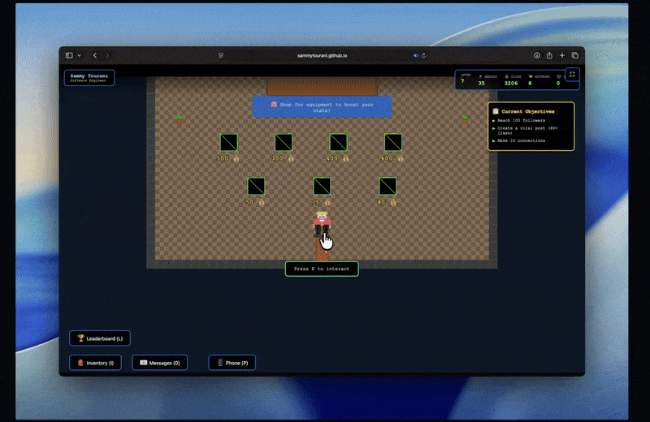

# LinkedIn Tycoon

  
   
   
  
  <h3><b>Rise from the bottom, master the corporate ladder, and build your empire.</b></h3>

  

    <a href="QUICKSTART.md">Quickstart</a> •
    <a href="DEPLOYMENT.md">Deployment</a> •
    <a href="CONTRIBUTING.md">Contributing</a>
  

---

## Experience the Grind

| **Explore a Living City** | **Ace the Interview** |
|:---:|:---:|
|  |  |
| Navigate a vibrant, open world filled with opportunities and secrets. | Prove your worth in high-stakes interviews to land your dream job. |

| **Build Your Wealth** | **Climb the Ranks** |
|:---:|:---:|
|  |  |
| Manage your finances, upgrade your lifestyle, and dress for success. | Compete with others and dominate the global leaderboards. |

---

## Tech Stack

- **Core**: HTML5, JavaScript (ES6+)
- **Styling**: Vanilla CSS3
- **Build**: Vite

---

  Built with ❤️ by Sammy Tourani

